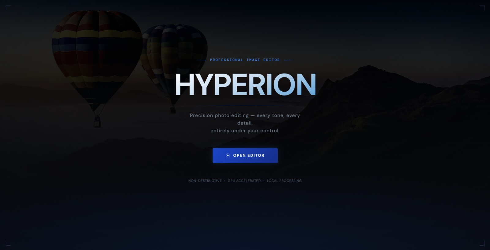
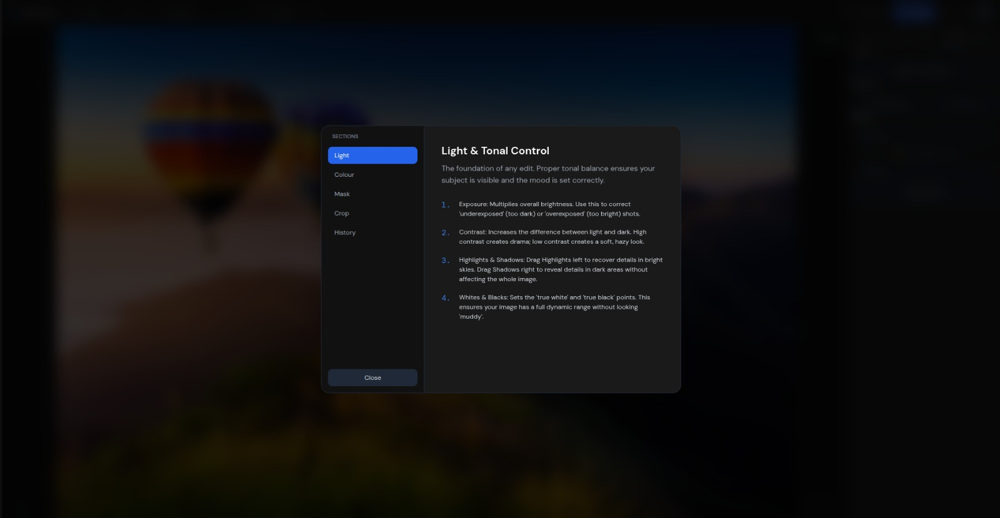

# Hyperion


Hyperion is a browser-based photo editor built with React. It supports global tonal and color adjustments, selective local masking, crop/rotate tools, multi-image workflow, and export in common web formats.

The application is designed for simplicity and ease of use, with a clean interface and intuitive controls. It runs entirely in the browser, with no server-side processing, making it fast and responsive.


<!-- Hero screenshot: place the file at assets/screenshots/hero.png -->



## Do I need Node.js?


- If you are only using the deployed website on Vercel: No.
- If you want to run or build the project locally: Yes (Node.js is required).


## What it includes


- Multi-image editing with gallery and filmstrip navigation
- Global adjustments: exposure, contrast, highlights, shadows, whites, blacks, color controls
- Local masking tools for selective edits
- Crop, rotate, and aspect-ratio tools
- Compare mode (hold Space) to preview original image
- Undo/redo history
- Export single or multiple images (JPEG, PNG, WEBP)
- Session restore (IndexedDB)

## Help Manual

<!-- Modal/editor screenshots: place the file at assets/screenshots/modal.png -->


*A help manual added for the ease of the user, explaining various features and functionalities.*


## Project structure


- frontend: React + Vite app
- hyperion-backend: Express backend for help docs and feedback storage
- vercel.json: rewrite rules for SPA/API routing


## Prerequisites (local development only)


- Node.js 18+
- npm


## Setup


Install dependencies:


```bash
cd frontend && npm install
cd ../hyperion-backend && npm install
```


## Run locally


### Option 1: Frontend development only


```bash
cd frontend
npm run dev
```


Open the URL shown by Vite (usually http://localhost:5173).


Note: this mode runs only the frontend. Endpoints under /api (help + feedback) are not provided unless you run the backend separately.


### Option 2: Full local app (recommended)


Build frontend first, then run the backend server that serves the built app and API:


```bash
cd frontend
npm run build


cd ../hyperion-backend
node server.js
```


Open http://localhost:5000/api/edit


## Deployment (Vercel)


- End users only need the deployed URL in a browser.
- Node.js is only needed by contributors/developers working locally.
- Vercel rewrite rules are defined in vercel.json.


## API used by the frontend


- GET /api/help/manual.json: returns help/manual content
- POST /api/feedback: accepts JSON payload:


```json
{
  "email": "optional@example.com",
  "message": "Your feedback"
}
```


Local backend appends feedback entries to feedback.txt.


## Supported formats


- Import: JPEG, PNG, WEBP
- Max upload size: 30 MB per file
- Export: JPEG, PNG, WEBP


## Keyboard shortcuts


- Ctrl+O: open image(s)
- Ctrl+Z: undo
- Ctrl+Y or Ctrl+Shift+Z: redo
- Ctrl+E: export
- Ctrl+0: fit to screen
- C: start crop mode (when an image is active)
- Space (hold): compare with original
- Tab: toggle side panel
- Esc: close export modal / cancel crop


